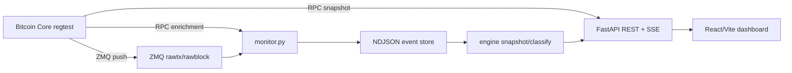

# NodeScope

**Bitcoin Core Intelligence Dashboard**

Real-time observability for Bitcoin Core nodes using RPC, ZMQ, mempool monitoring, and regtest demos.

[](https://github.com/btcneves/NodeScope/actions/workflows/ci.yml)
[](https://www.python.org/)
[](https://fastapi.tiangolo.com/)
[](https://react.dev/)
[](LICENSE)

## Problem

Bitcoin Core exposes powerful operational data, but it is split across RPC calls, ZMQ binary streams, mempool state and command-line workflows. Developers and node operators need a clear way to see current node state and live events without manually stitching those sources together.

## Solution

NodeScope combines:

- **RPC snapshots** for chain, node and mempool state.
- **ZMQ events** for `rawtx` and `rawblock` updates in real time.
- **Append-only NDJSON logs** for replayable event storage.
- **Classification engine** for block, payment, coinbase-like, OP_RETURN-like and complex transaction signals.
- **FastAPI + SSE** for structured JSON and live streaming.
- **React dashboard** for a professional visual demo.

## Architecture



RPC gives the snapshot. ZMQ gives real time. NodeScope gives interpretation.

## Features

| Feature | Status |
|---|---|
| Bitcoin Core RPC health and mempool summary | Ready |
| ZMQ monitor for `rawtx` and `rawblock` | Ready |
| Append-only NDJSON event storage | Ready |
| Snapshot rebuild from logs | Ready |
| Transaction and block classification | Ready |
| REST API and Server-Sent Events | Ready |
| React/Vite/TypeScript dashboard | Ready |
| Regtest demo script | Ready |
| Docker Compose demo stack | Ready |
| CI with backend tests, frontend build and public-clean check | Ready |

## Quickstart With Docker

```bash
git clone https://github.com/btcneves/NodeScope.git
cd NodeScope
cp .env.example .env
docker compose up --build
```

Services:

| Service | URL / Port |
|---|---|
| Dashboard | http://localhost:5173 |
| API | http://localhost:8000 |
| Bitcoin Core regtest RPC | `127.0.0.1:18443` |
| ZMQ rawblock | `127.0.0.1:28332` |
| ZMQ rawtx | `127.0.0.1:28333` |

If local services already use those ports, set the `HOST_*` values in `.env` before running Compose. Example:

```bash
HOST_BITCOIN_RPC_PORT=18444
HOST_ZMQ_RAWBLOCK_PORT=28342
HOST_ZMQ_RAWTX_PORT=28343
HOST_API_PORT=18000
HOST_FRONTEND_PORT=15173
```

Validate Compose without starting containers:

```bash
docker compose config
```

## Quickstart Without Docker

```bash
git clone https://github.com/btcneves/NodeScope.git
cd NodeScope
bash scripts/quickstart.sh
```

In separate terminals:

```bash
make backend
make monitor
make frontend
```

Open:

- Dashboard: http://localhost:5173
- API docs: http://127.0.0.1:8000/docs

## Bitcoin Core Setup

Copy [bitcoin.conf.example](bitcoin.conf.example) to your Bitcoin Core data directory when running locally:

```bash
mkdir -p ~/.bitcoin
cp bitcoin.conf.example ~/.bitcoin/bitcoin.conf
bitcoind -daemon
bitcoin-cli -regtest getblockchaininfo
bitcoin-cli -regtest getmempoolinfo
bitcoin-cli -regtest getzmqnotifications
```

Example regtest credentials are `nodescope` / `nodescope`. Replace them before any non-local use.

## Regtest Demo

Start the API, monitor and frontend, then generate live activity:

```bash
make demo
```

The demo script creates or loads the `nodescope_demo` wallet, mines initial blocks when needed, broadcasts a transaction, mines a confirmation block and prints the result. Watch the dashboard update through RPC polling and SSE/ZMQ-derived events.

## API Endpoints

| Method | Path | Description |
|---|---|---|
| `GET` | `/health` | API, storage and Bitcoin Core RPC status |
| `GET` | `/summary` | Event and classification summary |
| `GET` | `/mempool/summary` | Mempool stats via RPC with offline fallback |
| `GET` | `/events/recent` | Recent raw events |
| `GET` | `/events/classifications` | Classified events |
| `GET` | `/events/stream` | Server-Sent Events stream |
| `GET` | `/blocks/latest` | Latest observed block event |
| `GET` | `/tx/latest` | Latest observed transaction event |

Full reference: [docs/api.md](docs/api.md).

## Tests And Smoke Checks

```bash
make test
make build
make public-clean
```

With the backend running:

```bash
make smoke
```

The current suite has **35 Python tests** covering the API, RPC client, engine replay, parser, classifier, monitor payloads and demo assets.

## Repository Structure

```text
NodeScope/
├── api/                     FastAPI application
├── engine/                  NDJSON reader, parser, classifier and snapshot engine
├── frontend/                React/Vite/TypeScript dashboard
├── scripts/                 quickstart, demo, smoke and public-clean scripts
├── docs/                    architecture, API, Docker, demo and troubleshooting guides
├── tests/                   Python unit tests and fixtures
├── monitor.py               ZMQ subscriber and RPC enrichment writer
├── Dockerfile               API/monitor image
├── docker-compose.yml       regtest demo stack
├── Makefile                 local and Docker commands
├── .env.example             environment template
└── bitcoin.conf.example     local regtest Bitcoin Core config
```

## Troubleshooting

| Symptom | Fix |
|---|---|
| `/health` returns `rpc_ok: false` | Start `bitcoind` in regtest and confirm RPC credentials match `.env`. |
| No live events | Confirm `getzmqnotifications` lists rawblock and rawtx, then start `make monitor`. |
| Empty dashboard | Generate activity with `make demo` or inspect `/events/recent`. |
| Frontend cannot reach API | Use `make frontend` or Docker Compose so Vite proxy/API ports are aligned. |

More detail: [docs/troubleshooting.md](docs/troubleshooting.md).

## Roadmap

- Signet read-only profile.
- Persistent metrics export.
- Richer transaction heuristics.
- Dashboard filters for event type, confidence and script type.
- Release artifacts.

## Documentation

- [docs/README.md](docs/README.md)
- [docs/architecture.md](docs/architecture.md)
- [docs/api.md](docs/api.md)
- [docs/bitcoin-core-setup.md](docs/bitcoin-core-setup.md)
- [docs/docker.md](docs/docker.md)
- [docs/demo.md](docs/demo.md)
- [docs/smoke-tests.md](docs/smoke-tests.md)
- [docs/troubleshooting.md](docs/troubleshooting.md)

## License

MIT. See [LICENSE](LICENSE).
