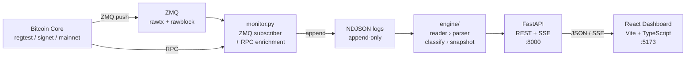

# NodeScope

**Bitcoin Core Intelligence Dashboard** — real-time observability for Bitcoin Core nodes.

[](https://github.com/btcneves/NodeScope/actions/workflows/ci.yml)
[](https://www.python.org/)
[](https://fastapi.tiangolo.com/)
[](https://react.dev/)
[](LICENSE)

---

## The Problem

Bitcoin Core exposes powerful data — but it is scattered across dozens of RPC commands, raw ZMQ binary streams, mempool state, and command-line output. There is no single place to observe what is actually happening inside a node in real time.

Operators and developers who want to understand block arrivals, unconfirmed transactions, mempool pressure, and transaction patterns need to poll multiple endpoints, pipe raw hex, and decode everything manually.

**NodeScope solves this.**

---

## The Solution

NodeScope is a full-stack observability platform that sits in front of Bitcoin Core and turns raw node data into a clear, useful dashboard.

- **ZMQ subscriber** captures every `rawtx` and `rawblock` event the moment Bitcoin Core emits it
- **RPC enrichment** decodes transactions and queries chain state in real time
- **Classification engine** labels each event with heuristics: coinbase, payment, OP_RETURN, complex
- **REST API + SSE** exposes everything as structured JSON and a live event stream
- **React dashboard** displays KPIs, mempool intelligence, live feed, blocks, transactions, and classifications — updating every 5 seconds and via Server-Sent Events

---

## Architecture

```
Bitcoin Core (regtest / signet / mainnet)
  ├── ZMQ rawtx   → tcp://127.0.0.1:28333
  └── ZMQ rawblock → tcp://127.0.0.1:28332
          │
      monitor.py          ZMQ subscriber + RPC enrichment
          │
  logs/YYYY-MM-DD-monitor.ndjson    append-only event store
          │
      engine/             reader → parser → classify → snapshot
          │
      api/ (FastAPI)      REST endpoints + Server-Sent Events
          │
   frontend/ (React)      dashboard — port 5173
```



---

## Features

| Feature | Description |
|---|---|
| Live ZMQ ingestion | Captures `rawtx` and `rawblock` the moment Bitcoin Core emits them |
| RPC enrichment | Decodes transactions and queries chain state via `bitcoin-cli` |
| Append-only NDJSON | Structured event store — replay-safe, zero ops overhead |
| Classification engine | Labels events: `coinbase_like`, `simple_payment_like`, `block_event`, `unknown` |
| Mempool intelligence | Live size, bytes, usage and min-fee via RPC |
| Server-Sent Events | Real-time dashboard updates without polling |
| React dashboard | Dark-themed UI with KPI cards, live feed, blocks, transactions, classifications |
| 35 automated tests | Engine, API, RPC client, SSE stream |
| Docker Compose | One-command backend stack |
| Regtest demo | Idempotent script to generate wallet, transactions, and blocks |

---

## Demo

> : *[link coming soon — see []()]*

### What it looks like

```
NodeScope Dashboard  ●API  ●RPC  ●SSE   [regtest]          ↺ Refresh

Events  Classifications  Mempool TX  Mempool Bytes  Block Height  Latest TX
  42         18            3           1.2 KB          103        a1b2c3...

┌─ Mempool ─────────┐  ┌─ Latest Block ──────────┐  ┌─ Latest TX ────────┐
│ TX count:      3  │  │ Height:          103     │  │ TXID: a1b2c3...    │
│ Bytes:      1.2KB │  │ Hash: 000abc...          │  │ Inputs:        1   │
│ Min fee: 0.00001  │  │ Time: 2026-05-04 14:32   │  │ Outputs:       2   │
└───────────────────┘  └──────────────────────────┘  └────────────────────┘

Live ZMQ Events                     Recent Events
● zmq_rawtx  a1b2c3...  14:32:01   zmq_rawblock  103  000abc...
● zmq_rawblock  103      14:32:00   zmq_rawtx     a1b2...
```

---

## Quick Start

### Option A — Docker (recommended for demos)

```bash
git clone https://github.com/btcneves/NodeScope.git
cd NodeScope
cp .env.example .env          # edit if needed

docker compose up --build     # starts API on :8000 + ZMQ monitor
cd frontend && npm install && npm run dev   # starts dashboard on :5173
```

Requires Bitcoin Core running on the host with ZMQ enabled.

### Option B — Local (development)

```bash
git clone https://github.com/btcneves/NodeScope.git
cd NodeScope
make setup                    # creates venv, installs Python + Node deps

# Terminal 1 — Backend API
make backend                  # http://127.0.0.1:8000

# Terminal 2 — ZMQ Monitor
make monitor                  # listens on ZMQ ports 28332/28333

# Terminal 3 — Frontend
make frontend                 # http://localhost:5173
```

---

## Bitcoin Core Setup

See [docs/bitcoin-core-setup.md](docs/bitcoin-core-setup.md) for the full guide.

Minimum `~/.bitcoin/bitcoin.conf` for regtest:

```ini
regtest=1
rpcuser=nodescope
rpcpassword=nodescope
rpcbind=127.0.0.1
rpcallowip=127.0.0.1
zmqpubrawblock=tcp://127.0.0.1:28332
zmqpubrawtx=tcp://127.0.0.1:28333
txindex=1
```

Start and verify:

```bash
bitcoind -daemon
bitcoin-cli -regtest getblockchaininfo
bitcoin-cli -regtest getzmqnotifications
```

---

## Running a Demo

Generate live wallet activity in regtest (idempotent, safe to run multiple times):

```bash
make demo
# or: bash scripts/demo_regtest.sh
```

The script:
1. Creates or loads the `nodescope-demo` wallet
2. Mines 101 initial blocks if balance is zero
3. Sends 1.5 BTC to a new address (broadcasts to ZMQ as `rawtx`)
4. Shows the pending mempool entry
5. Mines 1 block to confirm (broadcasts to ZMQ as `rawblock`)

Watch the dashboard at `http://localhost:5173` update in real time.

---

## API Reference

| Method | Path | Description |
|---|---|---|
| `GET` | `/health` | Node status, RPC connectivity, event count |
| `GET` | `/summary` | Aggregate stats: events, classifications, script types |
| `GET` | `/mempool/summary` | Live mempool stats via RPC |
| `GET` | `/events/recent` | Recent NDJSON events (filterable, paginated) |
| `GET` | `/events/classifications` | Classified events (filterable, paginated) |
| `GET` | `/events/stream` | Server-Sent Events stream (live) |
| `GET` | `/blocks/latest` | Latest block seen via ZMQ |
| `GET` | `/tx/latest` | Latest transaction seen via ZMQ |

Full reference: [docs/api.md](docs/api.md)

Interactive docs: `http://127.0.0.1:8000/docs` (Swagger UI when API is running)

---

## Environment Variables

| Variable | Default | Description |
|---|---|---|
| `BITCOIN_RPC_URL` | `http://127.0.0.1:18443` | Bitcoin Core RPC endpoint |
| `BITCOIN_RPC_USER` | `nodescope` | RPC username |
| `BITCOIN_RPC_PASSWORD` | `nodescope` | RPC password |
| `ZMQ_RAWBLOCK_URL` | `tcp://127.0.0.1:28332` | ZMQ rawblock endpoint |
| `ZMQ_RAWTX_URL` | `tcp://127.0.0.1:28333` | ZMQ rawtx endpoint |
| `NODESCOPE_LOG_DIR` | `./logs` | NDJSON log directory |

Copy `.env.example` to `.env` to configure.

---

## Testing

```bash
# All 35 unit tests
make test

# Static compilation check
make lint

# Smoke test (requires running backend)
make smoke

# Frontend build
cd frontend && npm run build
```

---

## Project Structure

```
NodeScope/
├── monitor.py              ZMQ subscriber + RPC enrichment
├── engine/                 NDJSON replay pipeline
│   ├── reader.py           NDJSON validation and iteration
│   ├── parser.py           TxEvent / BlockEvent normalization
│   ├── classify.py         Transaction classification heuristics
│   ├── snapshot.py         load_snapshot() — single source of truth
│   ├── analytics.py        Aggregate counters
│   └── models.py           Typed dataclasses
├── api/                    FastAPI application
│   ├── app.py              Route definitions + CORS
│   ├── service.py          Business logic + SSE generator
│   ├── rpc.py              Bitcoin Core JSON-RPC client (stdlib only)
│   └── schemas.py          Pydantic response models
├── frontend/               React + Vite + TypeScript dashboard
├── scripts/
│   ├── run_api.py          Uvicorn launcher
│   ├── demo_regtest.sh     Regtest demo (wallet, tx, block)
│   ├── smoke-test.sh       Automated smoke tests
│   └── check-public-clean.sh  Pre-commit safety check
├── tests/                  34 unittest tests + fixtures
├── docs/                   Architecture, API, setup, demo, troubleshooting
├── Makefile                Developer shortcuts
├── Dockerfile              Backend container image
├── docker-compose.yml      API + monitor stack
├── .env.example            Environment configuration template
└── logs/                   Runtime NDJSON logs (gitignored)
```

---

## Roadmap

| Phase | Status | Description |
|---|---|---|
| Phase 1 — Regtest | **Done** | Full stack on regtest: ZMQ, RPC, engine, API, dashboard |
| Phase 2 — Signet | Planned | Connect to Bitcoin signet for public testnet data |
| Phase 3 — Mainnet | Planned | Read-only mainnet observability with privacy safeguards |
| Phase 4 — Alerts | Planned | Threshold alerts for mempool, block time, unusual tx patterns |
| Phase 5 — Metrics | Planned | Prometheus/Grafana export for long-term node health tracking |

---

## Docs

- [Architecture](docs/architecture.md)
- [API Reference](docs/api.md)
- [Bitcoin Core Setup](docs/bitcoin-core-setup.md)
- [Demo Guide](docs/demo.md)
- [Troubleshooting](docs/troubleshooting.md)
- []()
- [Contributing](CONTRIBUTING.md)
- [Security](SECURITY.md)
- [Changelog](CHANGELOG.md)

---

## Contributing

See [CONTRIBUTING.md](CONTRIBUTING.md).

---

## License

MIT. See [LICENSE](LICENSE).
