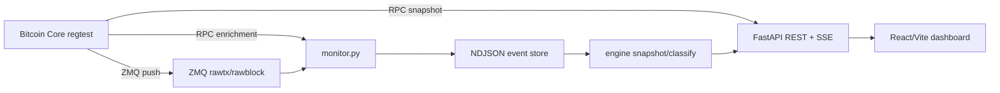

# NodeScope

**Bitcoin Core Intelligence Dashboard**

Observabilidade em tempo real para nós Bitcoin Core via RPC, ZMQ, monitoramento de mempool e demos em regtest.

[](https://github.com/btcneves/NodeScope/actions/workflows/ci.yml)
[](https://www.python.org/)
[](https://fastapi.tiangolo.com/)
[](https://react.dev/)
[](https://www.typescriptlang.org/)
[](https://bitcoincore.org/)
[](https://github.com/btcneves/NodeScope)
[](docker-compose.yml)
[](README.md)
[](LICENSE)

[Read in English](README.md)

---

## O Problema

O Bitcoin Core expõe dados operacionais poderosos — mas distribuídos em três fontes separadas: chamadas RPC, streams binários ZMQ e o estado da mempool. Desenvolvedores e operadores de nós precisam de uma forma clara de visualizar o estado atual e os eventos ao vivo, sem costurar manualmente essas fontes.

## A Solução

O NodeScope une essas três fontes em uma única interface:

- **Snapshots RPC** — estado da chain, do nó e da mempool.
- **Eventos ZMQ** — `rawtx` e `rawblock` em tempo real.
- **Logs NDJSON append-only** — armazenamento reprocessável de eventos.
- **Engine de classificação** — blocos, pagamentos, coinbase, OP_RETURN e transações complexas.
- **FastAPI + SSE** — JSON estruturado e streaming ao vivo.
- **Dashboard React** — visualização completa em tempo real.

> **RPC gives the snapshot. ZMQ gives real time. NodeScope gives interpretation.**

## Arquitetura



## Funcionalidades

| Funcionalidade | Status |
|---|---|
| Health e mempool via Bitcoin Core RPC | Pronto |
| Monitor ZMQ para `rawtx` e `rawblock` | Pronto |
| Armazenamento NDJSON append-only | Pronto |
| Reconstrução de snapshot a partir dos logs | Pronto |
| Classificação de transações e blocos | Pronto |
| API REST e Server-Sent Events | Pronto |
| Dashboard React/Vite/TypeScript | Pronto |
| Script de demo regtest | Pronto |
| Stack Docker Compose | Pronto |
| CI com testes, build e public-clean | Pronto |
| Node Health Score visual | Pronto |
| Transaction Lifecycle animado | Pronto |

## Início Rápido com Docker

```bash
git clone https://github.com/btcneves/NodeScope.git
cd NodeScope
cp .env.example .env
docker compose up -d
make docker-demo
make smoke
```

Serviços disponíveis após a inicialização:

| Serviço | URL / Porta |
|---|---|
| Dashboard | http://localhost:5173 |
| API | http://localhost:8000 |
| Bitcoin Core RPC | `127.0.0.1:18443` |
| ZMQ rawblock | `127.0.0.1:28332` |
| ZMQ rawtx | `127.0.0.1:28333` |

## Início Rápido Sem Docker

```bash
git clone https://github.com/btcneves/NodeScope.git
cd NodeScope
make setup-local
```

Em terminais separados:

```bash
make backend    # API FastAPI na porta 8000
make monitor    # ZMQ subscriber (requer Bitcoin Core ativo)
make frontend   # Dashboard Vite na porta 5173
```

Abrir no browser:
- Dashboard: http://localhost:5173
- Docs da API: http://127.0.0.1:8000/docs

## Configuração do Bitcoin Core

Copie [bitcoin.conf.example](bitcoin.conf.example) para o diretório de dados do Bitcoin Core:

```bash
mkdir -p ~/.bitcoin
cp bitcoin.conf.example ~/.bitcoin/bitcoin.conf
bitcoind -daemon
bitcoin-cli -regtest getblockchaininfo
bitcoin-cli -regtest getzmqnotifications
```

Credenciais de exemplo: `nodescope` / `nodescope`. Substitua antes de qualquer uso não-local.

## Demo Regtest

Com API, monitor e frontend ativos:

```bash
make demo
```

O script cria ou carrega a wallet `nodescope_demo`, minera blocos iniciais quando necessário, transmite uma transação, minera um bloco de confirmação e exibe o resultado. Observe o dashboard atualizar via polling RPC e eventos SSE/ZMQ.

## Endpoints da API

| Método | Caminho | Descrição |
|---|---|---|
| `GET` | `/health` | Status da API, storage e RPC do Bitcoin Core |
| `GET` | `/summary` | Resumo de eventos e classificações |
| `GET` | `/mempool/summary` | Stats da mempool via RPC com fallback offline |
| `GET` | `/events/recent` | Eventos brutos recentes |
| `GET` | `/events/classifications` | Eventos classificados |
| `GET` | `/events/stream` | Stream Server-Sent Events |
| `GET` | `/blocks/latest` | Último bloco capturado |
| `GET` | `/tx/latest` | Última transação capturada |

Referência completa: [docs/api.md](docs/api.md).

## Testes e Validações

```bash
make test          # testes Python dentro do container da API
make build         # TypeScript strict + Vite build dentro do container Node
make public-clean  # Verifica artefatos locais e segredos
make smoke         # valida API/RPC, frontend build e testes em Docker
```

Para desenvolvimento local sem Docker após `make setup-local`:

```bash
make test-local
make build-local
make smoke-local
```

## Variáveis de Ambiente

| Variável | Padrão | Descrição |
|---|---|---|
| `BITCOIN_RPC_URL` | `http://127.0.0.1:18443` | Endpoint RPC do Bitcoin Core |
| `BITCOIN_RPC_USER` | `nodescope` | Usuário RPC |
| `BITCOIN_RPC_PASSWORD` | `nodescope` | Senha RPC |
| `ZMQ_RAWBLOCK_URL` | `tcp://127.0.0.1:28332` | Socket ZMQ rawblock |
| `ZMQ_RAWTX_URL` | `tcp://127.0.0.1:28333` | Socket ZMQ rawtx |
| `NODESCOPE_LOG_DIR` | `logs/` | Diretório de logs NDJSON |

Consulte [.env.example](.env.example) para todas as variáveis disponíveis.

## Estrutura do Repositório

```text
NodeScope/
├── api/                     Aplicação FastAPI
├── engine/                  Reader, parser, classificador e snapshot engine
├── frontend/                Dashboard React/Vite/TypeScript
├── scripts/                 quickstart, demo, smoke e public-clean
├── docs/                    Arquitetura, API, Docker, demo e troubleshooting
├── tests/                   Testes unitários Python e fixtures
├── monitor.py               ZMQ subscriber e writer de eventos
├── Dockerfile               Imagem da API/monitor
├── docker-compose.yml       Stack de demo regtest
├── Makefile                 Comandos locais e Docker
├── .env.example             Template de variáveis de ambiente
└── bitcoin.conf.example     Config do Bitcoin Core para regtest local
```

## Troubleshooting

| Sintoma | Solução |
|---|---|
| `/health` retorna `rpc_ok: false` | Inicie `bitcoind` em regtest e confirme as credenciais RPC no `.env` |
| Nenhum evento ao vivo | Confirme que `getzmqnotifications` lista rawblock e rawtx, depois inicie `make monitor` |
| Dashboard vazio | Gere atividade com `make demo` ou inspecione `/events/recent` |
| Frontend sem dados | Use `make frontend` ou Docker Compose para alinhar as portas do proxy Vite |

Detalhes: [docs/troubleshooting.md](docs/troubleshooting.md).

## Roadmap

- Modo observador read-only em signet.
- Export de métricas persistentes.
- Heurísticas de classificação mais ricas.
- Filtros no dashboard por tipo de evento, confidence e script type.
- Autenticação para deploys remotos.

Ver [ROADMAP.md](ROADMAP.md) para o planejamento detalhado.

## Documentação

- [docs/README.md](docs/README.md) — índice da documentação
- [docs/architecture.md](docs/architecture.md) — arquitetura técnica
- [docs/api.md](docs/api.md) — referência completa da API
- [docs/bitcoin-core-setup.md](docs/bitcoin-core-setup.md) — configuração do Bitcoin Core
- [docs/docker.md](docs/docker.md) — uso com Docker Compose
- [docs/demo.md](docs/demo.md) — guia de demo
- [docs/demo-checklist.md](docs/demo-checklist.md) — checklist pré-demo
- [docs/troubleshooting.md](docs/troubleshooting.md) — problemas comuns

## Contribuindo

Veja [CONTRIBUTING.md](CONTRIBUTING.md).

## Segurança

Veja [SECURITY.md](SECURITY.md).

## Licença

MIT. Veja [LICENSE](LICENSE).
