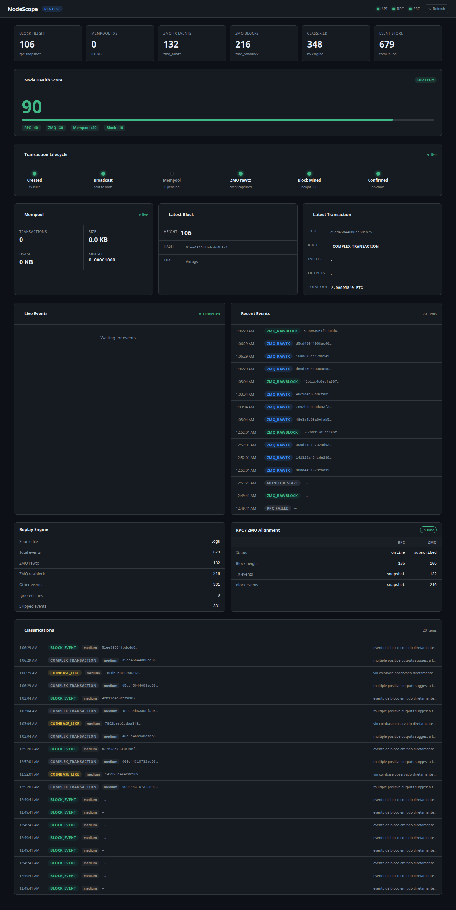
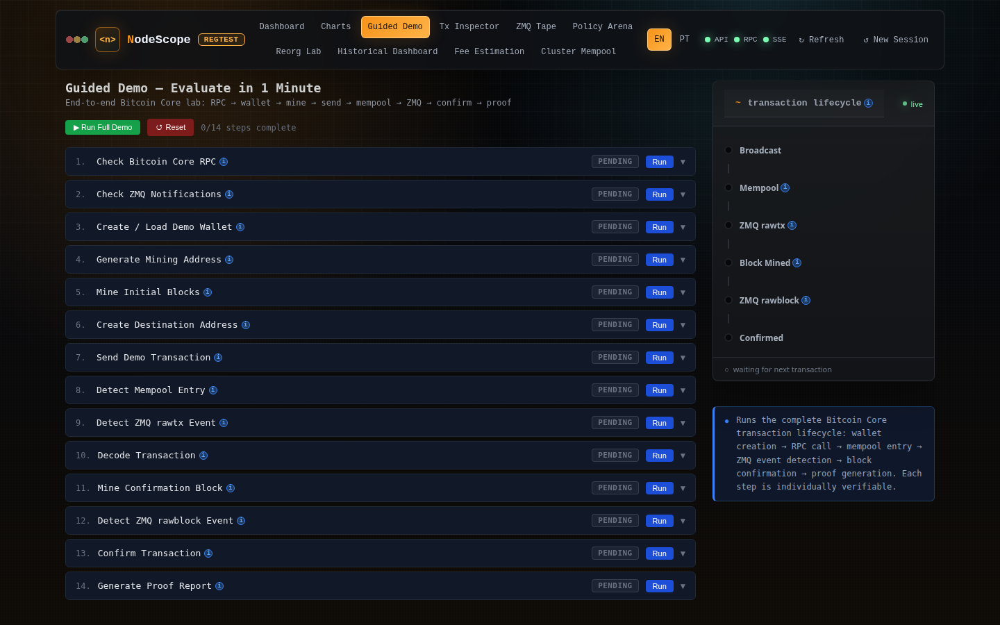
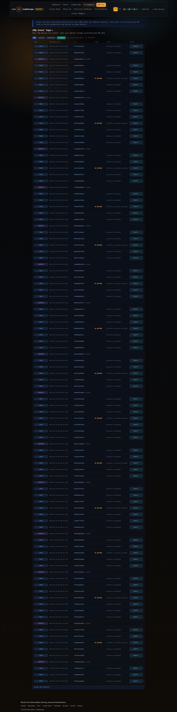
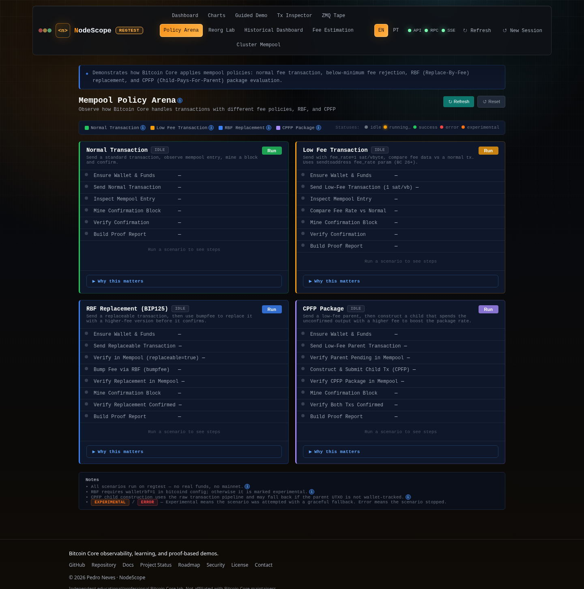
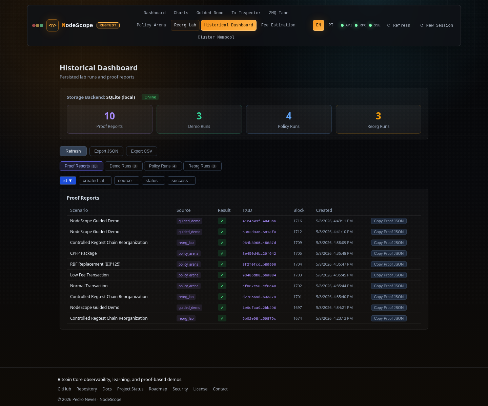

# NodeScope

[](https://github.com/btcneves/NodeScope/releases/tag/v1.1.0)
[](https://github.com/btcneves/NodeScope/actions/workflows/ci.yml)
[](https://www.python.org/)
[](https://fastapi.tiangolo.com/)
[](https://react.dev/)
[](https://www.typescriptlang.org/)
[](https://bitcoincore.org/)
[](https://github.com/btcneves/NodeScope)
[](docker-compose.yml)
[](https://github.com/btcneves/NodeScope)
[](README.md)
[](LICENSE)

[Read in English](README.md)

**Laboratório Profissional Bitcoin Core** — Um laboratório visual, guiado e auditável para entender
os internos do Bitcoin Core em tempo real usando RPC, ZMQ, análise de mempool e cenários de teste controlados.

---

## O que é o NodeScope?

O NodeScope conecta diretamente a um nó Bitcoin Core via JSON-RPC e ZMQ, expondo cada camada do
ciclo de vida das transações em um dashboard no browser. É projetado como uma ferramenta de observabilidade
educacional e profissional — não é uma carteira, não é um processador de pagamentos.

Propriedades principais:
- **Bitcoin Core real** — sem simulação, sem mocks. Cada dado vem de RPC ou ZMQ.
- **Ambiente regtest** — seguro, controlado, reproduzível. Sem fundos reais, sem risco na mainnet.
- **Auditável** — cada cenário gera um Relatório de Prova (JSON) copiável com toda a saída técnica.
- **Autossuficiente** — um `docker compose up` inicia o Bitcoin Core, a API, o monitor ZMQ e o frontend.

---

## Por que o NodeScope é Diferente

A maioria das ferramentas de desenvolvimento Bitcoin foca em gerenciamento de carteiras ou fluxos de
pagamento. O NodeScope foca na **camada de protocolo**: o que acontece dentro do Bitcoin Core quando
uma transação é transmitida, como ela entra na mempool, como é confirmada, quais políticas de taxa a
aceitam ou rejeitam, e o que ocorre durante uma reorganização de cadeia.

O NodeScope é construído para desenvolvedores e operadores que querem entender o Bitcoin Core por dentro.

---

## Avalie em 1 Minuto

```bash
git clone https://github.com/btcneves/NodeScope
cd NodeScope
docker compose up -d --build
open http://localhost:5173
```

Clique em **Guided Demo** → **Run Full Demo** e assista 14 etapas executando ao vivo, terminando com um Relatório de Prova.

---

## Preview Visual

As capturas abaixo foram geradas a partir de uma stack regtest local com Bitcoin Core RPC, ZMQ, API,
monitor e frontend em execucao.



| Guided Demo | ZMQ Event Tape |
|---|---|
|  |  |

| Policy Arena | Dashboard Historico |
|---|---|
|  |  |

---

## Caminho do Avaliador

A avaliação completa leva 10–15 minutos a partir de um clone limpo. **Pré-requisitos:** Docker e Docker Compose.

```bash
git clone https://github.com/btcneves/NodeScope
cd NodeScope
docker compose up -d --build
```

Aguarde ~30 segundos para o Bitcoin Core inicializar, depois abra **http://localhost:5173**.

**1. Guided Demo** — Navegue até **Guided Demo** → **Run Full Demo**.
As 14 etapas executam ao vivo. Ao final, copie ou baixe o **Relatório de Prova** (JSON).
Verifique: cada etapa mostra ✓; o Relatório de Prova contém TXIDs reais, taxas, vsizes, block hashes, sinais ZMQ.

**2. Transaction Inspector** — Clique em qualquer TXID do Relatório de Prova, ou navegue até **Inspector** e cole um TXID.
Verifique: txid, wtxid, vsize, weight, taxa em sat/vB, tipos de script, status de confirmação, altura do bloco.

**3. Policy Arena** — Navegue até **Policy Arena** e execute os quatro cenários em sequência.
Verifique: RBF mostra dois TXIDs (original + substituição com taxa mais alta); CPFP mostra parent + child com taxa de pacote calculada; cada cenário gera seu próprio Relatório de Prova.

**4. Fee Estimation** — Navegue até **Fee Estimation**.
Verifique: estimativas para alvos de 1/3/6/12 blocos; status honestamente `unavailable` ou `limited` em regtest — nenhum valor inventado.

**5. Reorg Lab** — Navegue até **Reorg Lab** → **Run Reorg**.
Verifique: 10 etapas — tx confirmada → `invalidateblock` → retorno para mempool → mineração de recuperação → re-confirmação → Relatório de Prova com timeline completa.

**6. ZMQ Event Tape** — Navegue até **ZMQ Tape**.
Verifique: stream de eventos rawtx/rawblock ao vivo; clique em qualquer TXID para abri-lo no Inspector.

**7. Dashboard Histórico** — Navegue até **History**.
Verifique: todas as execuções dos passos 1–5 aparecem com nome do cenário, status, duração e botão de cópia de prova.

**8. Métricas Prometheus** — Em um terminal:
```bash
curl http://localhost:8000/metrics | grep nodescope_
```
Verifique: `nodescope_demo_runs_total`, `nodescope_proof_reports_total`, `nodescope_chain_height`, `nodescope_rpc_up 1`.

**9. Smoke test** — Na raiz do projeto:
```bash
make smoke
```
Saída esperada: `PASS=15 FAIL=0 WARN=0`.

**10. Alternância de idioma** — Clique no seletor de idioma (canto superior direito). Alterne entre EN-US e PT-BR.
Verifique: todos os rótulos, botões e descrições atualizam sem recarregar a página.

**11. Materiais do avaliador** — Para checklist completa de reprodutibilidade e FAQ:
- [`docs/presentation/evaluator-checklist.md`](docs/presentation/evaluator-checklist.md)
- [`docs/presentation/faq.md`](docs/presentation/faq.md)

---

## Arquitetura

```
Bitcoin Core (regtest)
  ├── JSON-RPC :18443   ──► FastAPI (api/)        ──► React (frontend/)
  └── ZMQ :28332/:28333 ──► monitor.py (logs/)    ──► SSE stream → browser
```

- **api/** — Python 3.12 + FastAPI. Todas as chamadas RPC, orquestração de cenários, montagem de provas.
- **frontend/** — React 18 + TypeScript + Vite. UI no browser, sem etapa de build necessária para Docker.
- **monitor.py** — Subscreve ao ZMQ rawtx + rawblock, enriquece via RPC, escreve NDJSON em logs/.
- **docker-compose.yml** — Quatro serviços: `bitcoind`, `api`, `monitor`, `frontend`.

---

## RPC + ZMQ

O NodeScope usa os seguintes RPCs do Bitcoin Core:

| Categoria    | RPCs Usados |
|-------------|-------------|
| Chain        | `getblockchaininfo`, `getblockcount`, `getblockhash`, `getblock` |
| Network      | `getnetworkinfo`, `getzmqnotifications` |
| Mempool      | `getmempoolinfo`, `getrawmempool`, `getmempoolentry` |
| Transactions | `sendtoaddress`, `gettransaction`, `getrawtransaction`, `decoderawtransaction` |
| Raw Tx       | `createrawtransaction`, `fundrawtransaction`, `signrawtransactionwithwallet`, `sendrawtransaction` |
| Wallet       | `createwallet`, `loadwallet`, `listwallets`, `getnewaddress`, `getwalletinfo`, `listunspent` |
| Mining       | `generatetoaddress` |
| RBF          | `bumpfee` |
| Reorg        | `invalidateblock`, `reconsiderblock` |

Tópicos ZMQ subscritos: `rawtx`, `rawblock`.

---

## Guided Demo

Um guia passo a passo de 14 etapas do ciclo de vida completo de uma transação Bitcoin:

1. Verificar conectividade RPC do Bitcoin Core
2. Verificar subscrições ZMQ rawtx/rawblock
3. Criar ou carregar a carteira de demo
4. Gerar um endereço de mineração
5. Minerar blocos iniciais (garantir saldo maduro)
6. Criar um endereço de destino
7. Enviar uma transação de demo
8. Detectar entrada na mempool (`getmempoolentry`)
9. Detectar evento ZMQ rawtx
10. Decodificar a transação bruta (versão, inputs, outputs, tipos de script)
11. Minerar um bloco de confirmação
12. Detectar evento ZMQ rawblock
13. Confirmar a transação (`gettransaction`)
14. Gerar um Relatório de Prova (JSON com todos os dados técnicos)

Cada etapa produz: status, timestamp, mensagem amigável, saída técnica e um payload de dados
incluído no Relatório de Prova final.

---

## Transaction Inspector

Análise premium de transações a partir do TXID:

- `txid` e `wtxid`
- `size`, `vsize`, `weight` (em unidades de peso)
- Taxa em BTC e taxa em sat/vbyte
- Contagem de inputs, contagem de outputs, tipos de script
- Status de confirmação, block hash, altura do bloco
- Status de validação RPC
- Eventos ZMQ relacionados vistos para este TXID
- Links para inspecionar qualquer TXID da ZMQ Tape ou da Policy Arena

---

## ZMQ Event Tape

Stream em tempo real de eventos ZMQ com enriquecimento:

- Cada evento `rawtx` mostra: txid (curto), vsize, tipos de script, presença de OP\_RETURN
- Cada evento `rawblock` mostra: block hash (curto), altura
- Filtrar por tópico (rawtx / rawblock) ou por TXID específico
- Clique em qualquer txid para inspecioná-lo no Transaction Inspector
- Eventos são enriquecidos via RPC no momento da captura pelo `monitor.py`

---

## Mempool Policy Arena

Quatro cenários interativos para explorar as políticas de mempool do Bitcoin Core:

### Transação Normal
`sendtoaddress` padrão → entrada na mempool → mineração do bloco → confirmação.
Captura: taxa, vsize, taxa (sat/vb), block hash.

### Transação com Taxa Baixa
Enviar com `fee_rate=1 sat/vbyte` → comparar taxa real com padrão → minar → confirmar.
Demonstra o parâmetro `fee_rate` do Bitcoin Core 26+ em `sendtoaddress`.

### Substituição RBF (BIP125)
Enviar transação substituível → verificar `bip125-replaceable=true` na mempool →
chamar `bumpfee` para substituir com versão de taxa mais alta → verificar novo TXID → minar → confirmar.

### Pacote CPFP
Enviar parent com taxa baixa → construir child que gasta output não confirmado do parent →
submeter child com taxa alta → calcular taxa do pacote → minar → confirmar ambos.
Usa o pipeline de transação bruta: `createrawtransaction` → `fundrawtransaction` →
`signrawtransactionwithwallet` → `sendrawtransaction`.

Cada cenário gera um Relatório de Prova copiável.

---

## RBF Playground

Disponível dentro da Mempool Policy Arena (cenário RBF Replacement).

- Envia uma transação substituível BIP125 (`replaceable=true` em `sendtoaddress`)
- Chama `bumpfee` para substituí-la antes da confirmação
- Verifica o novo TXID na mempool com taxa mais alta
- Minera um bloco e confirma a substituição

---

## CPFP Playground

Disponível dentro da Mempool Policy Arena (cenário CPFP Package).

- Envia uma transação parent com taxa baixa
- Localiza o output não confirmado do parent via `listunspent(minconf=0)`
- Constrói uma transação child gastando esse output com taxa alta
- Calcula a taxa do pacote: (taxa\_parent + taxa\_child) / (vsize\_parent + vsize\_child)
- Minera um bloco e confirma ambas as transações

---

## Reorg Lab

**Experimental** — reorganização controlada da cadeia em regtest.

Sequência:
1. Verificar que a rede é regtest
2. Garantir carteira e saldo maduro
3. Transmitir uma transação
4. Minerar um bloco (tx confirmada)
5. Chamar `invalidateblock` nesse bloco — tx retorna para a mempool
6. Verificar status da tx na mempool após invalidação (`getmempoolentry`)
7. Minerar um bloco de recuperação — tx re-confirmada
8. Verificar re-confirmação (`gettransaction`)
9. Chamar `reconsiderblock` — cadeia de recuperação permanece ativa (é mais longa)
10. Montar Relatório de Prova com timeline completa

A cadeia é sempre deixada em estado limpo. Se a recuperação falhar, a API retorna um erro explícito
com aviso — não mascara falhas.

> O Reorg Lab só funciona em regtest. Em qualquer outra rede, retorna `unavailable`.

---

## Compatibilidade com Cluster Mempool

O NodeScope verifica automaticamente se o nó Bitcoin Core conectado suporta RPCs de cluster mempool:

- `getmempoolcluster`
- `getmempoolfeeratediagram`

Se suportados, são usados e os resultados são exibidos. Se indisponíveis (Bitcoin Core 26 e anteriores),
o NodeScope retorna um status `unavailable` honesto com explicação clara — nunca um falso positivo.

Disponível via `GET /mempool/cluster/compatibility`, `GET /mempool/clusters` e na aba **Cluster Mempool**.

> RPCs de cluster mempool são esperados no Bitcoin Core 31+. Esta build usa Bitcoin Core 26.

---

## Playground de Estimativa de Taxa

O **Playground de Estimativa de Taxa** chama o RPC `estimatesmartfee` do Bitcoin Core para múltiplos alvos de confirmação e exibe os resultados lado a lado.

**O que mostra:**

| Alvo | Taxa (BTC/kvB) | Taxa (sat/vB) | Status |
|---|---|---|---|
| 1 bloco | dados RPC ao vivo | convertido | success / limited / unavailable |
| 3 blocos | dados RPC ao vivo | convertido | success / limited / unavailable |
| 6 blocos | dados RPC ao vivo | convertido | success / limited / unavailable |
| 12 blocos | dados RPC ao vivo | convertido | success / limited / unavailable |

**Conversão:** `sat/vB = BTC/kvB × 100.000`

**Modos de estimativa:** Conservador (taxa mais alta, confirmação mais segura) e Econômico (taxa mais baixa, potencialmente mais lento).

**Comparação:** Quando um cenário da Guided Demo ou da Policy Arena foi executado, o playground exibe opcionalmente essas taxas ao lado das estimativas.

**Limitações do regtest:** Em regtest não há mercado real de taxas. O `estimatesmartfee` pode retornar `insufficient data`. Os resultados são marcados como `success`, `limited` ou `unavailable` — nenhum valor é inventado. Isso está documentado honestamente na UI.

**Endpoints da API:**

| Método | Caminho | Descrição |
|---|---|---|
| GET | `/fees/estimate` | Estimativas para 4 alvos de confirmação |
| GET | `/fees/estimate?mode=ECONOMICAL` | Estimativas no modo econômico |
| GET | `/fees/compare` | Estimativas + comparação com taxas reais dos cenários |

---

## Persistência e Dashboard Histórico

O NodeScope persiste automaticamente metadados de execução em um banco SQLite local (`.nodescope/history.db`).
Cada execução da Guided Demo, cenário da Policy Arena e Reorg Lab armazena:

- JSON do relatório de prova (nome do cenário, fonte, status, TXIDs, dados do bloco)
- Registro de execução (status, duração, ID do relatório de prova vinculado)

A aba **Dashboard Histórico** na UI exibe uma visão paginada de todas as execuções passadas com:

- Cards de resumo: contagem de linhas por tabela e saúde do storage (SQLite ou memória)
- Tabela de Relatórios de Prova: cenário, fonte, badge sucesso/falha, TXID, altura do bloco, timestamp
- Tabelas de Demo Runs, Policy Runs, Reorg Runs com metadados completos
- Botão de cópia do JSON de prova para qualquer relatório

**Endpoints da API:**

| Método | Caminho | Descrição |
|---|---|---|
| GET | `/history/summary` | Saúde do storage e contagens |
| GET | `/history/proofs` | Relatórios de prova paginados |
| GET | `/history/proofs/{id}` | Relatório de prova por ID |
| GET | `/history/demo-runs` | Histórico de execuções da demo |
| GET | `/history/policy-runs` | Histórico de execuções da policy |
| GET | `/history/reorg-runs` | Histórico de execuções do reorg |

O backend de storage é configurável via `NODESCOPE_STORAGE_BACKEND=sqlite|memory`. Se o SQLite falhar,
a API usa um armazenamento em memória de forma transparente — sem interrupção de serviço.

---

## Relatórios de Prova

Cada cenário principal gera um Relatório de Prova — um documento JSON contendo:

- Nome da rede e versão do Bitcoin Core
- Todos os TXIDs envolvidos
- Taxas, vsizes, weights
- Block hashes e alturas
- Contagens de confirmação
- Timestamps
- Saídas técnicas passo a passo
- Avisos e recursos indisponíveis (contabilização honesta)

Os Relatórios de Prova são:
- Copiáveis para área de transferência na UI
- Baixáveis como JSON (Guided Demo)
- Auditáveis — todos os valores vêm de respostas RPC ao vivo, não de dados simulados

---

## Início Rápido

**Requisitos:** Docker, Docker Compose.

```bash
# Clonar
git clone https://github.com/btcneves/NodeScope
cd NodeScope

# Iniciar tudo
docker compose up -d --build

# Verificar
curl http://localhost:8000/health
curl http://localhost:8000/mempool/cluster/compatibility

# Abrir UI
open http://localhost:5173
```

**Ambiente:** copie `.env.example` para `.env` se precisar personalizar as credenciais RPC.

**Smoke test:**
```bash
make smoke
```

---

## Segurança

- Este projeto usa **regtest** — uma rede Bitcoin totalmente local e isolada.
- Nenhum fundo real é usado. Nenhuma transação na mainnet é feita na demo.
- As credenciais RPC são locais e configuráveis via `.env` (nunca commitadas).
- Nenhuma chave privada, seed ou dado de carteira é exposto via API.
- Os dados ZMQ são enriquecidos localmente e servidos apenas em localhost por padrão.
- O cenário do Reorg Lab só opera em regtest e inclui recuperação da cadeia.

---

## Internacionalização (PT-BR / EN-US)

O NodeScope inclui uma camada de internacionalização integrada com suporte a **Português (PT-BR)** e **Inglês (EN-US)**.

- Seletor de idioma visível no canto superior direito do header
- Persistido entre recarregamentos de página via `localStorage`
- Cobre todos os rótulos de navegação, botões de ação, indicadores de status, títulos de páginas, descrições e mensagens de erro
- Fallback para EN-US para qualquer chave ausente

Mude de idioma a qualquer momento sem recarregar a página.

---

## Camada de Explicabilidade

Cada página e visão inclui um painel de explicação contextual que responde:

1. **O que esta tela mostra?**
2. **Por que isso importa no Bitcoin?**
3. **O que você deve observar durante a demo?**

Esta camada foi projetada para avaliadores técnicos que querem entender o sistema rapidamente sem ler o código-fonte.

---

## Tooltips e Aprendizado Contextual

Termos técnicos em toda a interface incluem tooltips interativos. Passe o mouse (ou foque) em qualquer ícone **ⓘ** para ver uma definição clara. Termos com tooltips incluem:

`RPC` · `ZMQ` · `Mempool` · `TXID` · `WTXID` · `Fee` · `Fee rate` · `vbytes` · `Weight` · `Block hash` · `Block height` · `Confirmation` · `rawtx` · `rawblock` · `RBF` · `CPFP` · `Reorg` · `Cluster mempool` · `Proof Report` · `Wallet` · `Input` · `Output` · `replaceable`

Seções **Learn More** estão disponíveis na Policy Arena, ZMQ Tape, Reorg Lab, Transaction Inspector, Cluster Mempool e Proof Report — cada uma com uma explicação mais aprofundada do conceito Bitcoin demonstrado.

---

## Observabilidade

### Métricas Prometheus

O NodeScope expõe um endpoint `/metrics` compatível com Prometheus quando `prometheus-client` está instalado (incluído em `requirements.txt`):

```bash
curl http://127.0.0.1:8000/metrics
```

Métricas principais:

| Métrica | Tipo | Descrição |
|---|---|---|
| `nodescope_http_requests_total` | Counter | Requisições HTTP por método/endpoint/status |
| `nodescope_http_request_duration_seconds` | Histogram | Latência das requisições |
| `nodescope_rpc_up` | Gauge | 1 se o RPC do Bitcoin Core está acessível |
| `nodescope_rpc_requests_total` | Counter | Chamadas RPC ao Bitcoin Core |
| `nodescope_zmq_rawtx_events_total` | Counter | Eventos rawtx ZMQ capturados |
| `nodescope_zmq_rawblock_events_total` | Counter | Eventos rawblock ZMQ capturados |
| `nodescope_mempool_tx_count` | Gauge | Transações na mempool |
| `nodescope_chain_height` | Gauge | Altura atual da cadeia |
| `nodescope_demo_runs_total` | Counter | Execuções completas da Guided Demo |
| `nodescope_policy_scenarios_total` | Counter | Execuções da Policy Arena por cenário |
| `nodescope_reorg_runs_total` | Counter | Execuções do Reorg Lab |
| `nodescope_proof_reports_total` | Counter | Relatórios de prova gerados |
| `nodescope_history_proof_reports_total` | Gauge | Relatórios de prova persistidos no storage |
| `nodescope_history_demo_runs_total` | Gauge | Registros de demo persistidos |
| `nodescope_history_policy_runs_total` | Gauge | Registros de policy persistidos |
| `nodescope_history_reorg_runs_total` | Gauge | Registros de reorg persistidos |
| `nodescope_storage_up` | Gauge | 1 se o backend de storage está saudável |
| `nodescope_storage_backend_info` | Info | Backend de storage ativo (`sqlite` ou `memory`) |

### Alertas Operacionais

O dashboard inclui um painel de **Alertas Operacionais** que verifica o estado da API a cada 15 segundos e exibe:

- Bitcoin Core RPC offline (crítico)
- Erros na simulação ao vivo (aviso)
- RPCs de cluster mempool indisponíveis (info — esperado no BC26)
- Nota experimental do Reorg Lab (info)

Os alertas são exibidos em PT-BR ou EN-US conforme o idioma ativo.

### Benchmark

Meça a latência da API contra uma stack em execução:

```bash
python3 scripts/benchmark_nodescope.py
# ou
make benchmark
```

Saída: tabela de latência (min/média/mediana/p95/max) por endpoint. Os resultados variam por ambiente.

---

## Limitações

- **Apenas regtest** para cenários de demo. Observabilidade em mainnet/signet/testnet é possível com mudanças de configuração, mas não validada nesta versão.
- **RPCs de cluster mempool** (`getmempoolcluster`, `getmempoolfeeratediagram`) exigem Bitcoin Core 31+. Esta build usa Bitcoin Core 26 — esses RPCs retornam `unavailable` com explicação honesta.
- **Reorg Lab** é marcado como **experimental**: o cenário é reproduzível em regtest, mas pode ter comportamento diferente dependendo do estado da carteira.
- **Construção do child CPFP** requer que o output do parent esteja rastreado na carteira (`listunspent minconf=0`). Se não encontrado, um caminho alternativo é usado e a prova o registra.
- **Eventos ZMQ** são armazenados como NDJSON em `logs/`. Não há persistência entre reinicializações de container.
- **Histórico SQLite** (`.nodescope/history.db`) é local ao volume do container. O histórico não sobrevive ao `docker compose down -v` a menos que o volume seja preservado.
- **Métricas Prometheus** exigem `prometheus-client` (incluído em `requirements.txt`). Se não instalado, `/metrics` retorna um aviso de indisponibilidade em texto simples.

---

## Roadmap

| Funcionalidade | Status |
|---|---|
| Suporte a signet/testnet | Planejado |
| Modo read-only para redes públicas | Pronto (proteção bloqueia mutações de laboratório fora de regtest) |
| Visualização de cluster mempool | Pronto (grupos visuais via fallback; RPCs BC31+ detectados quando disponíveis) |
| Cenário de expulsão da mempool | Planejado |
| Topologia multi-nó | Planejado |
| Postgres / TimescaleDB para persistência de eventos | Planejado |
| Dashboards históricos | Pronto (SQLite) |
| Gráficos históricos | Pronto |
| Limiares de alerta configuráveis | Pronto |
| Rate limiting da API | Pronto |
| API keys para endpoints mutantes (opcional) | Pronto |
| OpenTelemetry traces | Planejado |
| Kubernetes manifests / Helm chart | Planejado |
| Pack Grafana + Prometheus | Pronto (`docker-compose.observability.yml`) |
| Exportação de histórico CSV/JSON | Pronto (`/history/export.json`, `/history/export.csv`) |
| Lint + format frontend (ESLint + Prettier) | Pronto |
| Playground de Estimativa de Taxa (`estimatesmartfee`) | Pronto |

---

## Apresentação e Avaliação

Materiais completos para juízes e avaliadores de hackathon:

| Documento | Descrição |
|---|---|
| [Pitch de 1 minuto](docs/presentation/pitch-1min.md) | Pitch curto — EN-US e PT-BR |
| [Pitch técnico de 3 minutos](docs/presentation/pitch-3min.md) | Pitch técnico completo com arquitetura e fluxo de demo |
| [Checklist do avaliador](docs/presentation/evaluator-checklist.md) | Checklist passo a passo para reproduzir e avaliar todas as funcionalidades |
| [Roteiro de demo](docs/presentation/demo-script.md) | Roteiro operacional — versões de 1 e 5 minutos |
| [Roteiro de vídeo](docs/presentation/video-script.md) | Roteiro cena a cena para vídeo de 2–3 minutos |
| [Texto de submissão](docs/presentation/submission-text.md) | Texto pronto para formulários de submissão — EN-US e PT-BR |
| [FAQ](docs/presentation/faq.md) | Respostas honestas às perguntas mais comuns dos avaliadores |
| [Índice do presentation pack](docs/presentation/README.md) | Índice completo dos materiais de apresentação |

---

## Licença

MIT — veja [LICENSE](LICENSE).

---

*NodeScope é uma ferramenta de observabilidade para desenvolvedores. Não fornece aconselhamento financeiro,
serviços de custódia ou execução de transações na mainnet. Os cenários de demo usam apenas regtest.*
